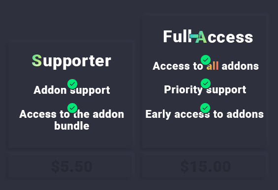

---
hide:
  - toc
---
<figure markdown>
  
</figure>
# Supporting SnowKatie and my Addons

## What does Subscribing to our Packages get you?
!!! failure "Packages and Subscriptions are not yet available. Please buy addons individually."

!!! success "One-Time offer for early supporters"
    Ending on ``TO BE DECIDED`` or when we hit ``50`` Subscribers, I'm setting up a **one time** offer that will never be recreated! The Full-Access tier will get access to **all** future scripts whilst in our subscription. On ``TO BE DECIDED`` this package tier will be unavailable to any new customers, existing customers will then have full access to all future scripts.

    Note, as in our promises, we will release a minimum of ``1 Script Per Month.``! That's our minimum.

---

## Available Tiers Currently.
> *Full-Tier is only available until ``TO BE DECIDED``, after this date only the Supporter Tier will be available. Any existing customers will keep Full-Tier*

<figure markdown>
  
</figure>

---

## What is the addon bundle?
*The Addon Bundle is a selection of my addons that I've bundled together, when subscribing to a package you get access to all addons in the bundle forever. However support only lasts as long as the subscription. New addons will be added occasionally.*

**Addons included in Addon Bundle**

- [x] *:material-file-code: snowk-jobs-elec* ``£10.50 Standalone Price``

## You only have 1 addon!
*This is a completely valid point and anyone is welcome to buy addons at their Standalone price if they don't wish to go the subscription route. The Supporter Bundle will make much more sense when I have more addons completed. The Full-Tier package is for people who want to support the project early for rewards in the future.*