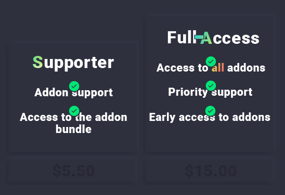

---
hide:
  - toc
---
<figure markdown>
  
</figure>
# Supporting SnowKatie and my Addons

## What does Subscribing to Patreon get you?
!!! success "One-Time offer for early supporters"
    Ending on ``April 5th`` or when we hit ``50`` Patreons, I'm setting up a **one time** offer that will never be recreated! The Full-Access tier will get access to **all** future scripts whilst in our Patreon. On ``April 5th`` this Patreon tier will be unavailable to any new customers, existing customers will then have full access to all future scripts.

    Note, as in our promises, we will release a minimum of ``1 Script Per Month.``! That's our minimum.

---

## Available Tiers Currently.
> *Full-Tier is only available until ``April 5th``, after this date only the Supporter Tier will be available. Any existing customers will keep Full-Tier*

<figure markdown>
  
</figure>

---

## What is the addon bundle?
*The Addon Bundle is a selection of my addons that I've bundled together, when subscribing to the Patreon you get access to all addons in the bundle forever. However support only lasts as long as the Patreon subscription. New addons will be added occasionally.*

**Addons included in Addon Bundle**

- [x] *:material-file-code: snowk-jobs-elec* ``$7.50 Standalone Price``

## You only have 1 addon!
*This is a completely valid point and anyone is welcome to buy addons at their Standalone price if they don't wish to go the Patreon route. The Supporter Bundle will make much more sense when I have more addons completed. The Full-Tier Patreon is for people who want to support the project early for rewards in the future.*